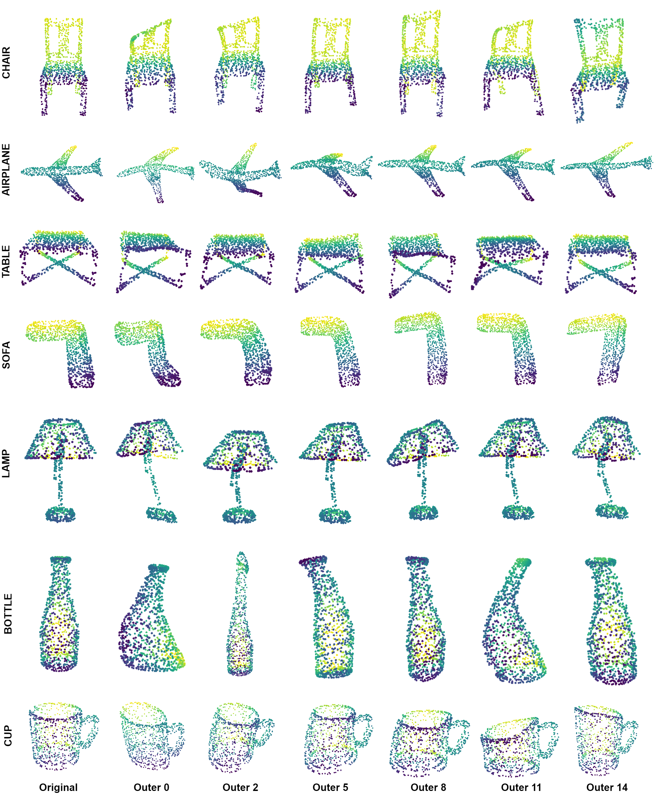

# BDAugment_anonymous

## Introduction
  This is the source code for our paper **BDAugment: Biharmonic Deformation Augmentation for Point Cloud Classification.**
  
  
## Dependencies
  - python 3.8
  - pytorch 1.7.1
  - CUDA 10.2 or 11.0
  - sklearn, h5py, pytorch3d, tqdm
  
  
## Data
Download the h5py file of ModelNet40 dataset and preprocessed data (biharminic coordinates, sampled control points, meta-handles, etc.) from [here](https://drive.google.com/file/d/1q_7vTKJJUJQ5jeBE-k0_L28tEdlkA4Ku/view?usp=sharing).
Unpack the zip file and put the subfolders in `/data`.

Alternatively, you can also download the h5py ModelNet40 dataset from [here](https://shapenet.cs.stanford.edu/media/modelnet40_ply_hdf5_2048.zip).

## Usage
You can train a PointNet model with BDAugment on GPU 0 with:

    python train_bdaugment.py --gpu 0 --log_dir BDAug_exp1
    

Also, you can train a baseline model with conventional data augmentation with:

    python train_baseline.py --gpu 0 --log_dir baseline_exp1

Log files and network parameters will be saved to `log` folder in default.
